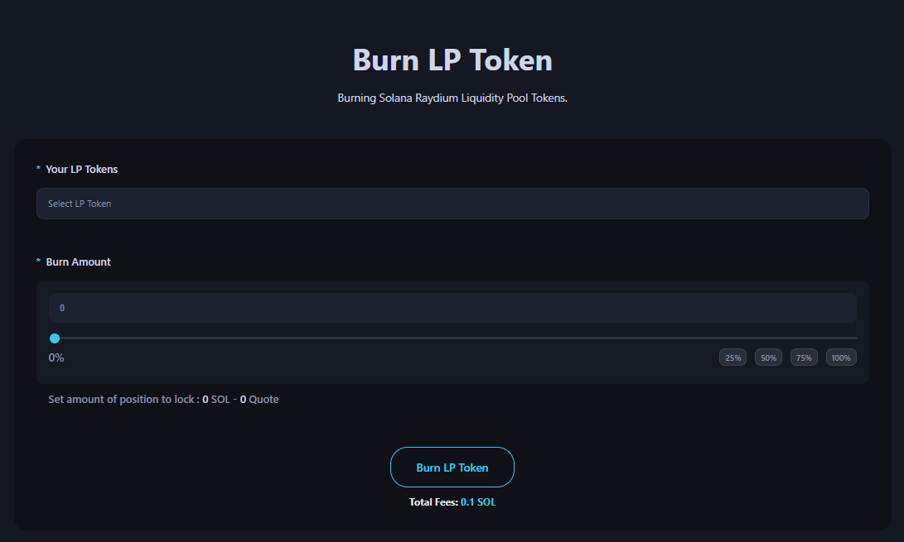

# Burn Liquidity Pool

The Burn Liquidity Pool page is a dApp tool that enables you to burn liquidity pool tokens on the Alphecca platform.

<figure><figcaption></figcaption></figure>

## ## Steps to Burn LP



### Connect Your Wallet

Supported wallets : Phantom, Solfare



### Select your LP token mint address.

You don’t need to know the address. Our platform integrates with your connected wallet to retrieve all your LP token mint addresses automatically.



### Enter the amount of LP tokens to burn.

You don’t need to know the burnable amount. Our platform retrieves the total balance of the selected LP token. Use the scrollbar or the 25%, 50%, 75%, 100% buttons on the right to adjust.

After entering the amount, you can check the amount of SOL and tokens to be burned from the liquidity pool.



### Click the "Burn LP" button and approve the transaction in your wallet app.



## &#x20;

