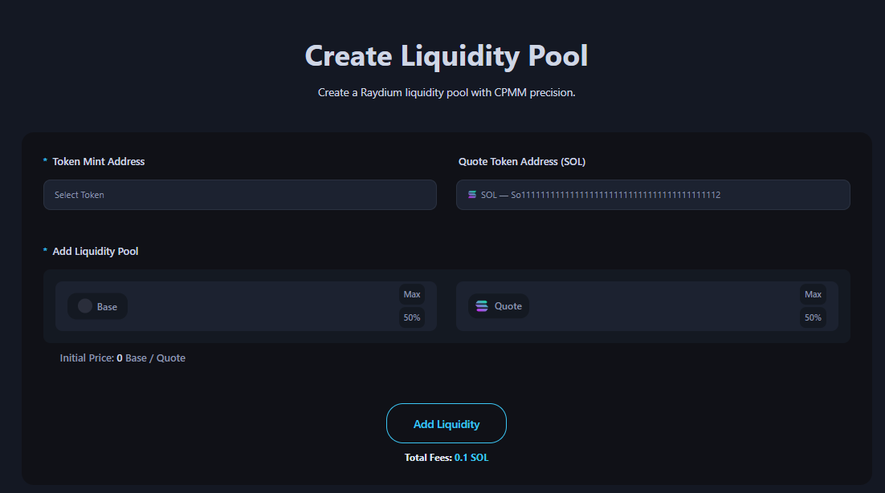

# Create Liquidity Pool

The Create Liquidity Pool page is a dApp tool that allows you to create a liquidity pool based on Raydium's CPMM model.

<figure><figcaption></figcaption></figure>

## ## Steps to Create a SPL Token.

1. Connect Your Wallet
 - Supported wallets : Phantom, Solfare

2. Select your token mint address to create LP.
 - You don’t need to know the address. Our platform integrates with your connected wallet to retrieve all your token mint addresses automatically.

3. Enter the amount of Base Token (your mint token) to add to the liquidity pool.
 - You don’t need to know the maximum amount you hold. Our platform retrieves the total balance of the selected token. Use the 50% and Max buttons on the right to adjust.

4. Enter the amount of Quote Token (SOL) to add to the liquidity pool.
 - You don’t need to know the maximum amount you hold. Our platform retrieves the total balance of the selected token. Use the 50% and Max buttons on the right to adjust.
 - After entering the amount(Base - Quote Token), you can check the initial price of the token.

5. Click the "Create LP" button and approve the transaction in your wallet app.

