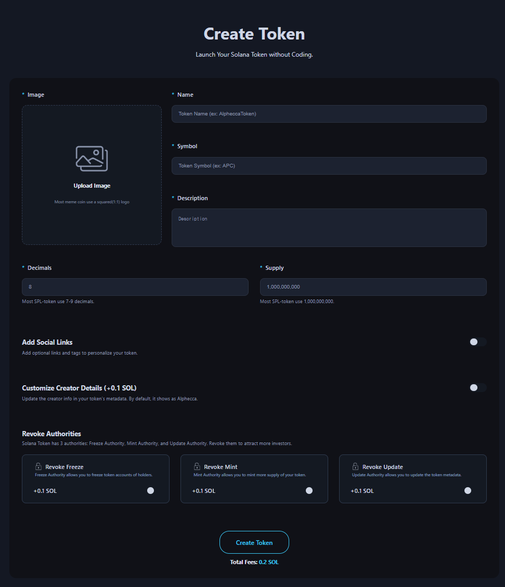

# Create Token

The Create Token page is a dApp tool that allows you to create your custom SPL token without coding.

<figure><figcaption></figcaption></figure>

## ## Steps to Create Token

1. Connect Your Wallet.
 - Supported wallets : Phantom, Solfare

2. Select an image for your token.
 - Most tokens use a 1 : 1 image ratio. If not, the central 1 : 1 portion will be displayed.

3. Enter the name of your token.

4. Enter the symbol of your token.

5. Enter a description for your token.

6. Enter the decimals for your token.
 - Most tokens use 6 - 9 decimals

7. Enter the supply amount.

8. \*\*Optional\*\* Add social links for your token.
 - Website, Twitter, Telegram, Discord

9. \*\*Optional\*\* Add token creator information.
 - By default : it shows an Alphecca.

10. \*\*Optional\*\* Choose to Revoke Authority.

11. Click the "Create Token" button and approve the transaction in your wallet app.

