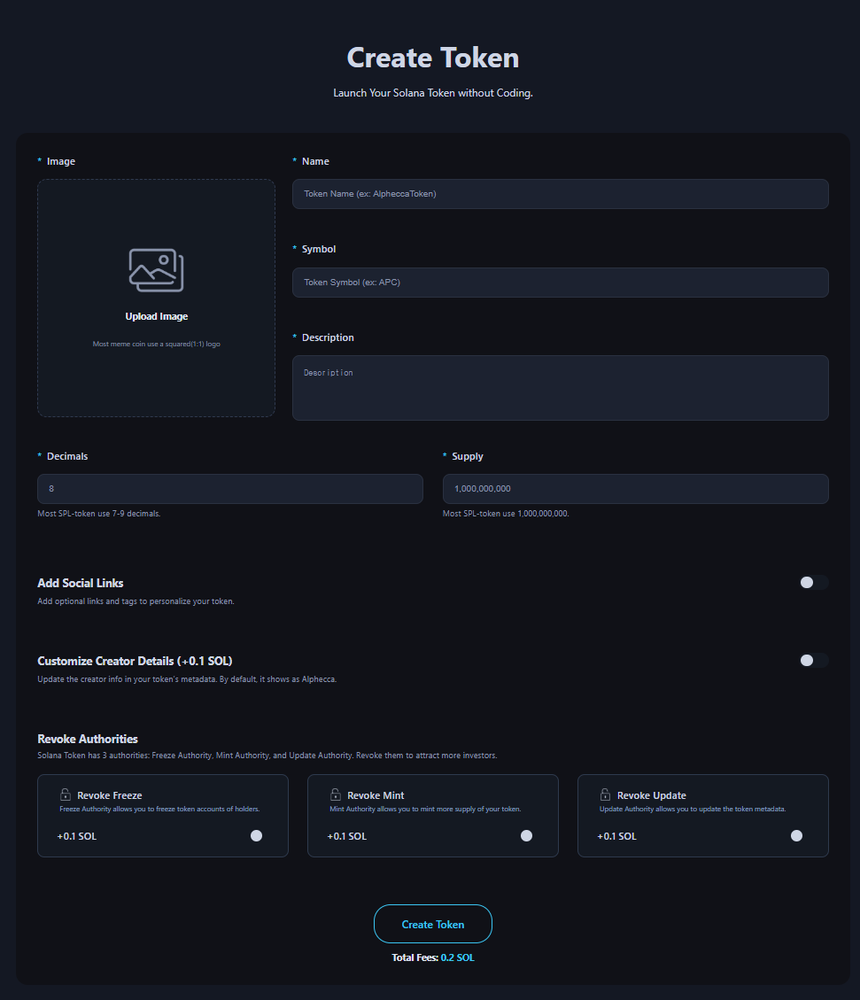

# Create Token

The Create Token page is a dApp tool that allows you to create your custom SPL token without coding.

<figure><figcaption></figcaption></figure>

## ## Steps to Create Token



### Connect Your Wallet.

Supported wallets : Phantom, Solfare



### Select an image for your token.

Most tokens use a 1 : 1 image ratio. If not, the central 1 : 1 portion will be displayed.



### Enter the name of your token.



### Enter the symbol of your token.



### Enter a description for your token.



### Enter the decimals for your token.

Most tokens use 6 - 9 decimals



### Enter the supply amount.



### \*\*Optional\*\* Add social links for your token.

Website, Twitter, Telegram, Discord



### \*\*Optional\*\* Add token creator information.

By default : it shows an Alphecca.



### \*\*Optional\*\* Choose to Revoke Authority.



### Click the "Create Token" button and approve the transaction in your wallet app.



## &#x20;

