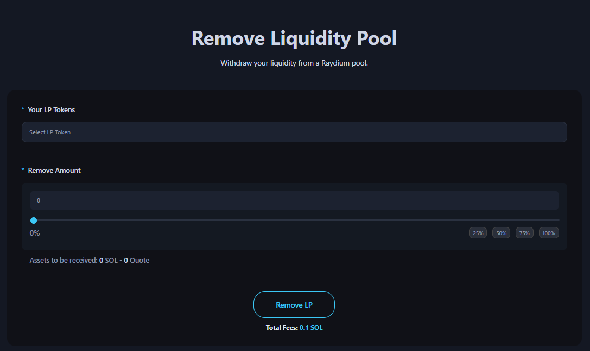

# Remove Liquidity Pool

The Remove Liquidity Pool page is a dApp tool that allows you to remove liquidity from a pool on the Alphecca platform.

<figure><figcaption></figcaption></figure>

## ## Steps to Remove LP

1. Connect Your Wallet
 - Supported wallets : Phantom, Solfare

2. Select your LP token mint address.
 - You don’t need to know the address. Our platform integrates with your connected wallet to retrieve all your LP token mint addresses automatically.

3. Enter the amount of LP tokens to remove.
 - You don’t need to know the removeable amount. Our platform retrieves the total balance of the selected LP token. Use the scrollbar or the 25%, 50%, 75%, 100% buttons on the right to adjust.
 - After entering the amount, you can check the amount of SOL and tokens to be withdrawn from the liquidity pool.
 - 
4. Click the "RemoveLP" button and approve the transaction in your wallet app

