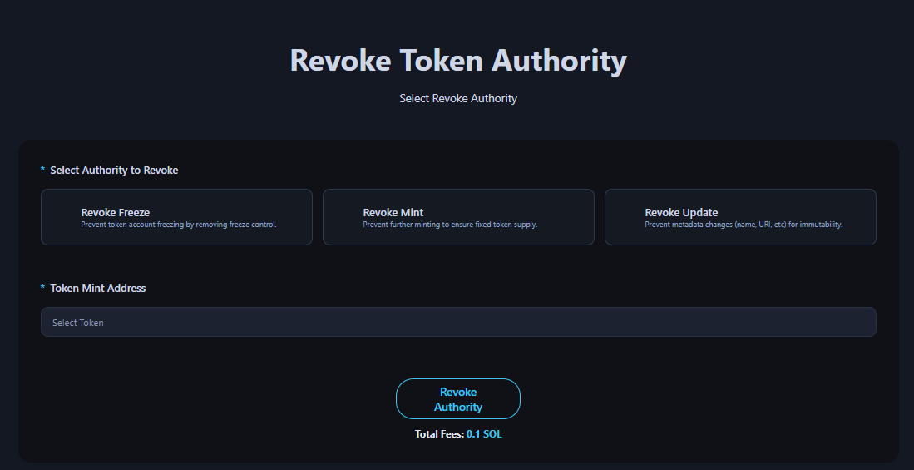

# Revoke Authority

The Revoke Authority page is a dApp tool that allows you to revoke the Freeze Mint Update authority.

<figure><figcaption></figcaption></figure>

## ## Steps to Revoke Authority



### Connect Your Wallet

Supported wallets : Phantom, Solfare



### Select type of Authority : (Freeze / Mint / Update).



### Select your token mint address to revoke authority.

You don’t need to know the address. Our platform integrates with your connected wallet to retrieve all your token mint addresses automatically.



### Click the "Revoke Authority" button and approve the transaction in your wallet app.



## &#x20;

