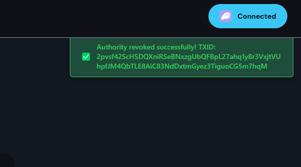
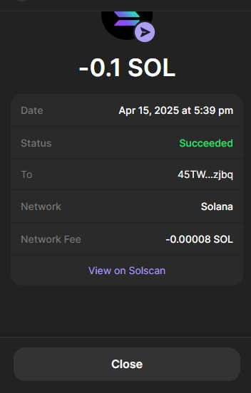
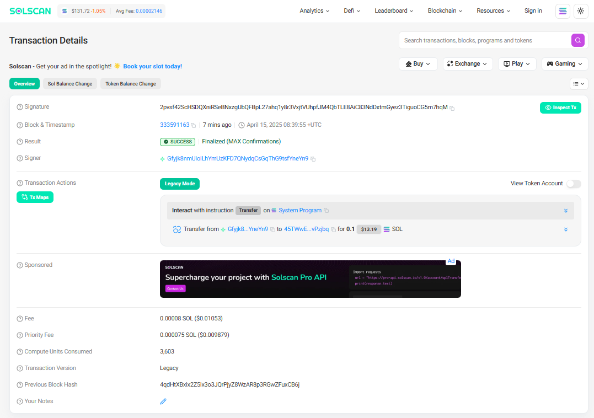

# How to Check your Order?

This page provides a guide to check the status of your order.

By default, our platform processes all transactions with a single signature. This means that even if a transaction fails due to unexpected issues, you will not lose your SOL.

However, if you want to confirm that your order was successfully completed, please follow the steps below.

## ## How to Check Your Transaction ID (Signature)

*   Once the transaction is complete, a green box will appear in the top-right corner of the screen, as shown in the image below. Here, you can find your transaction signature.\
    Copy this address and use it on Solscan to verify the details and results of the transaction you requested.

    
<figure><figcaption></figcaption></figure>

*   Alternatively, as shown in the image below, you can check the transaction in the history of your wallet app where you signed the transaction. Click the "View on Solscan" button to see the details.

    
<figure><figcaption></figcaption></figure>

*   You can immediately check your order on Solscan.

    
<figure><figcaption></figcaption></figure>

##
