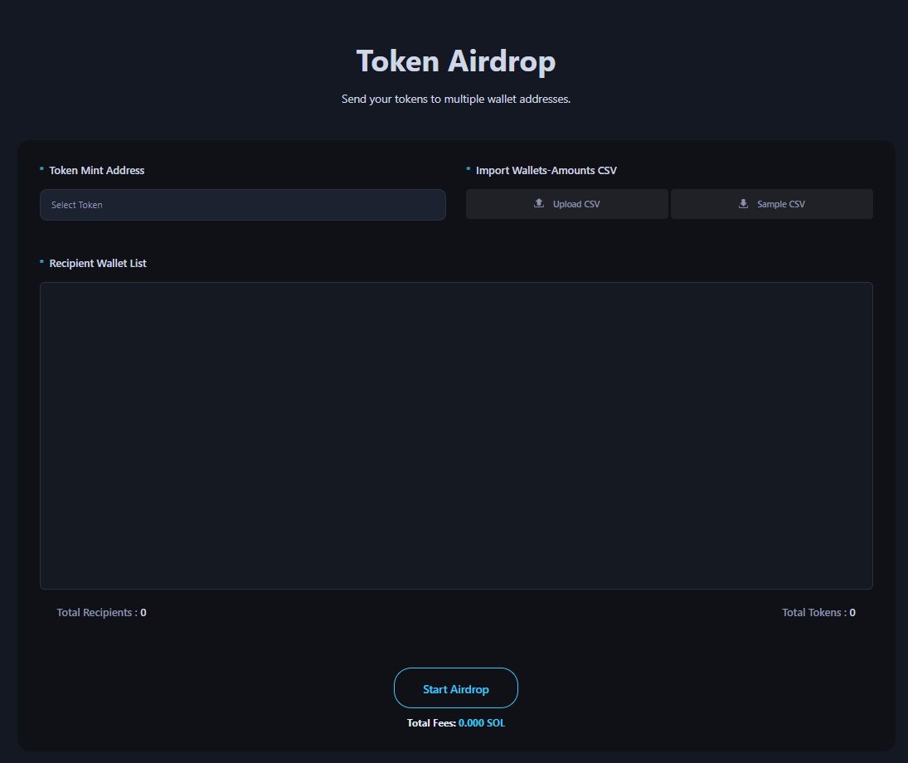

# Maker and Volume Bot

The Air Drop page is a dApp tool that provides a program for sending tokens to multiple addresses simultaneously.

<figure><figcaption></figcaption></figure>

## ## Steps to Air Drop

### 1. Connect Your Wallet

* Supported wallets: Phantom, Solflare

### 2. Select the Mint Token Address for Multi-Sending

* You don’t need to know the address. The platform can retrieve all the tokens you hold through your wallet app. Simply make a selection.

### 3. Import a CSV File with Recipient Wallet Addresses and Amounts

* You can download a sample CSV file. (Header will be ignored during the upload.)
* Check the total number of recipient wallets and the total token amount.

### 4. Click the "Air Drop" Button and Sign the Transaction
